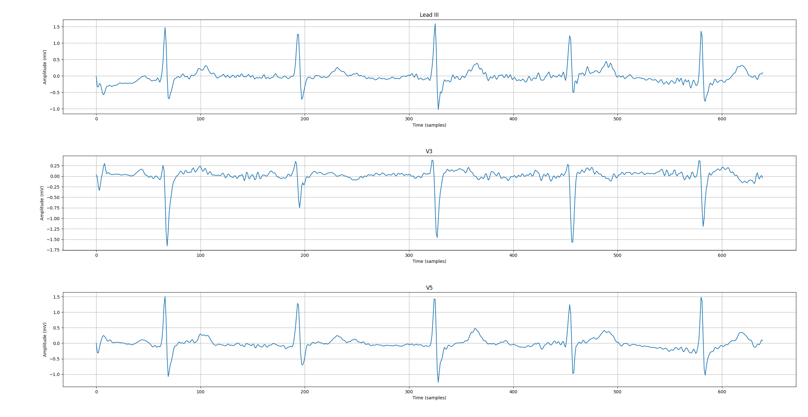
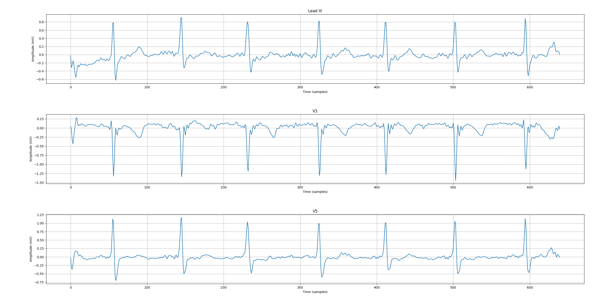
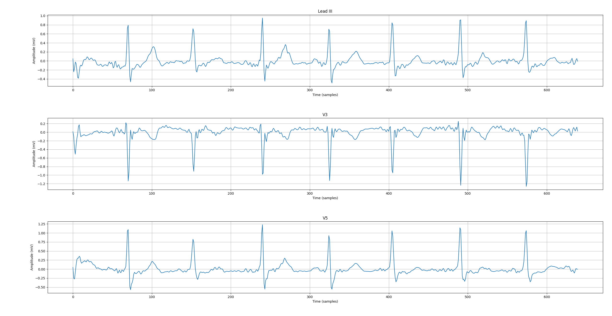
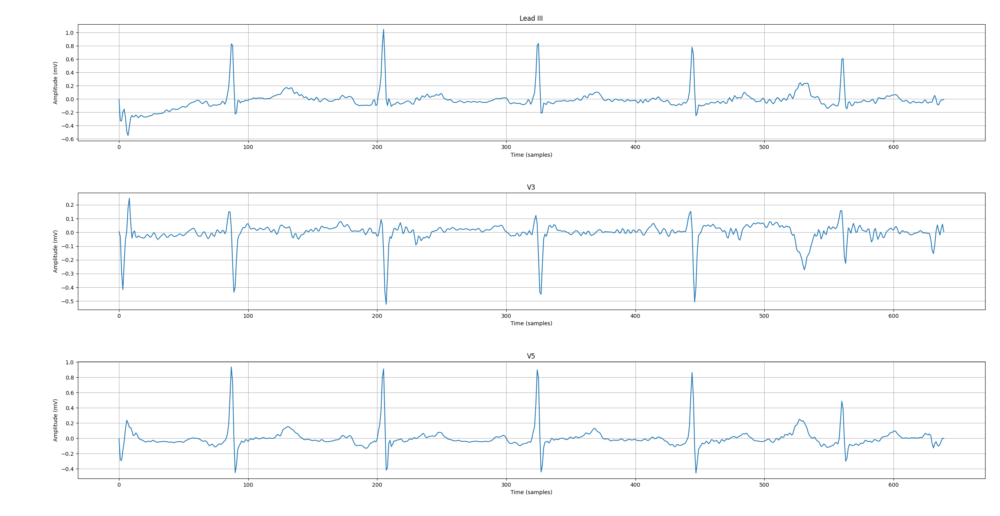

# Synthetic Data Generation for Cardiovascular Disease Risk Prediction

This repository holds the code for a project involving the creation of synthetic data to enable 

## Synthetic Tabular Data Generation

## Generative Adversarial Networks for Electrocardiogram Generation

A pair of generative adversarial networks (GANs) are provided in this repository. The first of these models is a Wasserstein GAN (WGAN) that uses gradient penalty (gp) and dynamic time warping (dtw) to generate 5 second segments of ECG data

### WGAN Network Architecture

### CWGAN Network Architecture

Generated image for the normal class of the SHAREEDB dataset.

## Data Fusion Classification

